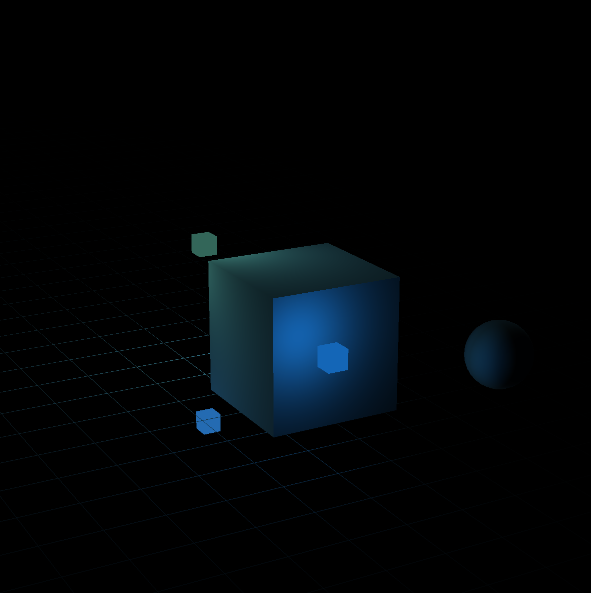

## Physics Modeling / Visualizer

Included dependencies are build for Windows only. If you plan to use this on a different architecture then mine, you will have to compile and include the binaries for the vendors yourself. Eventually I will add submodules, but not today.

Note about STB 3rd party library use in Texture.cpp:
- create a .cpp with only the following, where the include is pointing to your stb_image.h header file:
```
#define STB_IMAGE_IMPLEMENTATION
#include "../../../vendor/stb/stb_image.h"
```
- compile the obj file with:
```
g++ -c stb.cpp -o stb.o
```
- then
```
ar rcs stbdll.a stb.o
```
- Now move the static lib file to where the header file lives and add the paths to the makefile commands for the compiler to link to
- Append the include header preprocessor command where it is needed in the project

Documentation:
https://docs.gl

OpenGL Pipeline:
https://open.gl/drawing

GLFW Windows Guide:
https://www.glfw.org/docs/3.3/window_guide.html

Math Overview:
https://morning-flow.com/2023/02/06/the-math-behind-the-lookat-transform/
https://www.songho.ca/opengl/gl_projectionmatrix.html
https://open.gl/transformations

TODO:

- move uniform types list into the shader constructor
- add instanced rendering for models
- update floor/terrain to be "infinite" by default
- add simple gravity forces 
- add simple non-elastic collision forces
- refactor model update part of the game loop


